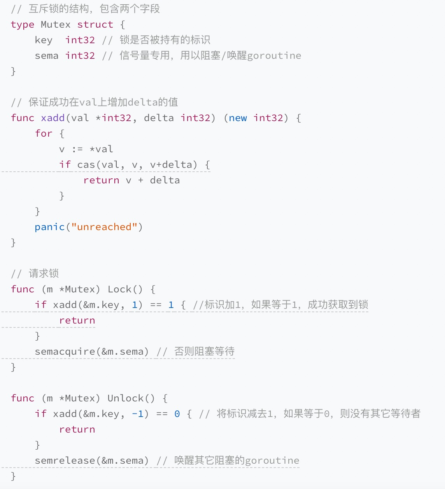
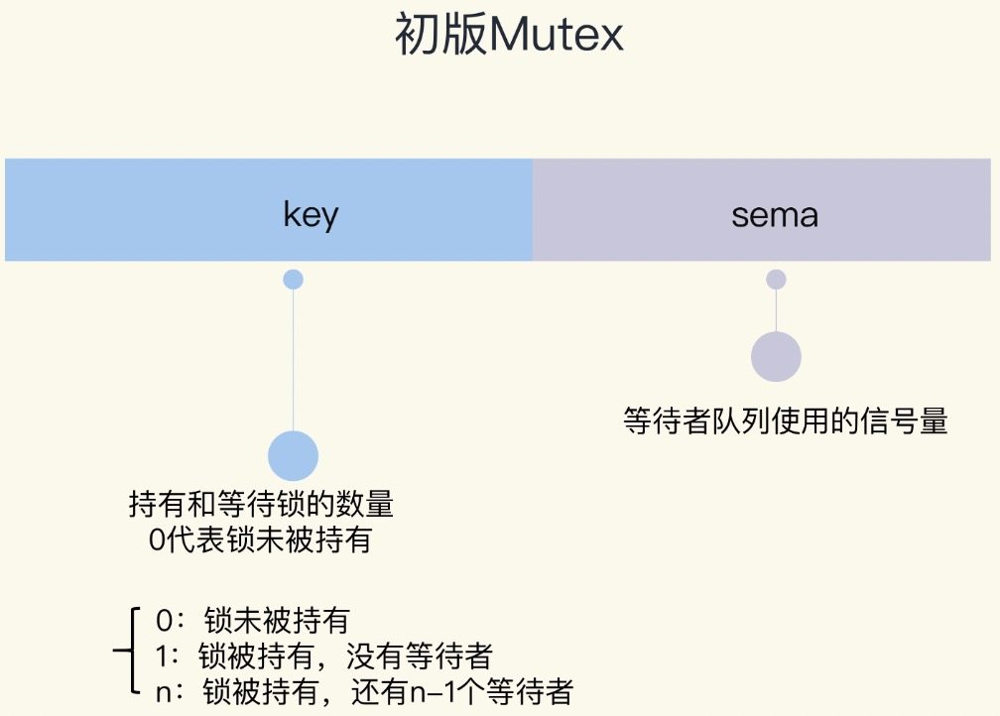
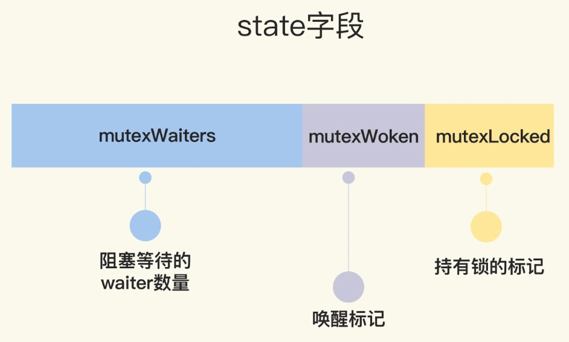
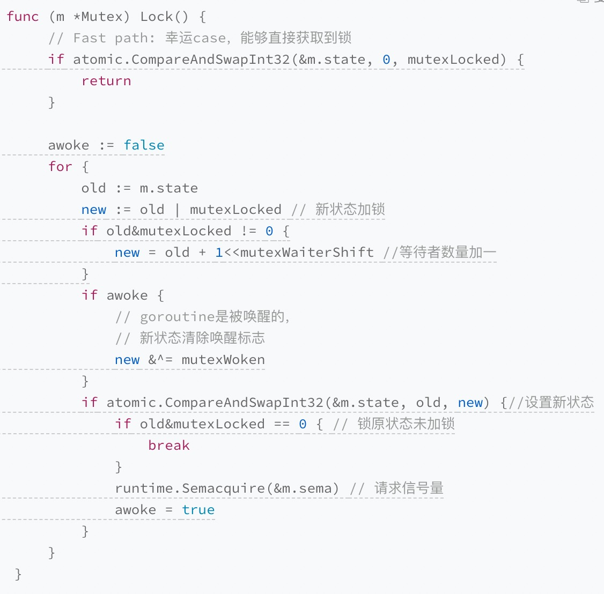
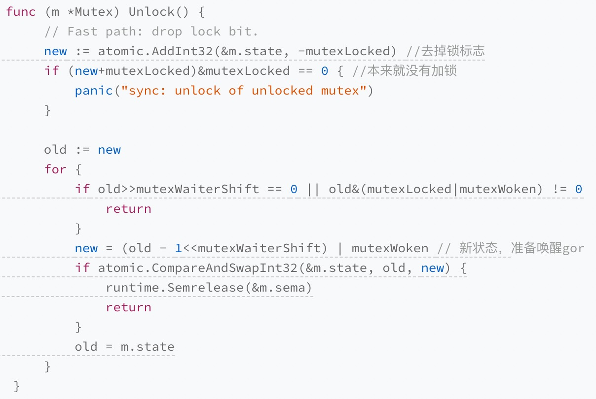
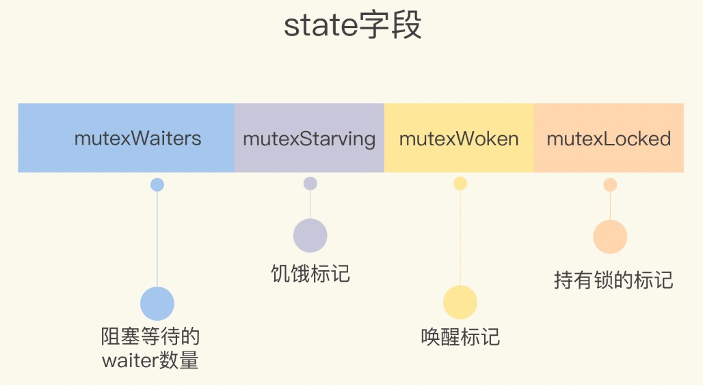
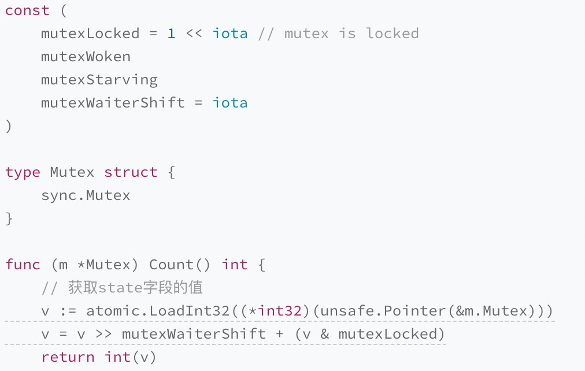
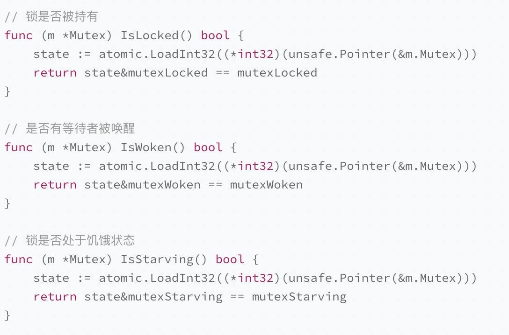

# 一、基础并发原语

## 1）Mutex

Mutex不需要额外的初始化，直接声明变量即可，如果嵌入的 struct 有多个字段，我们一般会把 Mutex 放在要控制的字段上面，然后使用空格把字段分隔开来。

> 同步机制实现基础

1. CAS(Compare And Swap)和原子运算。
2. 信号量sema
   按照runtime/sema.go中的注释：
   Think of them as a way to implement sleep and wakeup

Golang中的sema，提供了休眠和唤醒Goroutine的功能。

1. semacquire函数首先检查信号量是否为0：如果大于0，让信号量减一，返回；
   如果等于0，就调用goparkunlock函数，把当前Goroutine放入该sema的等待队列，并把他设为等待状态。
2. semrelease函数首先让信号量加一，然后检查是否有正在等待的Goroutine： 如果没有，直接返回；如果有，调用goready函数唤醒一个Goroutine。

> Mutex实现

### 1.1 初版Mutex

使用一个 flag 来表示锁是否被持有，实现比较简单：





初版的 Mutex 利用 CAS 原子操作，对 key 这个标志量进行设置。key 不仅仅标识了锁是否被 goroutine 所持有，还记录了当前持有和等待获取锁的
goroutine 的数量。

如果还有等待此锁的其它 goroutine，那么，它会调用 semrelease 方法（第 34 行），利用信号量唤醒等待锁的其它 goroutine 中的一个。

> 不足：性能不是最优的

请求锁的 goroutine 会排队等待获取互斥锁。虽然这貌似很公平，但是从性能上来看，却不是最优的。
因为如果我们能够把锁交给正在占用 CPU 时间片的 goroutine 的话，那就不需要做上下文的切换，在高并发的情况下，可能会有更好的性能。

### 1.2 给新人机会 （第二版Mutex）

Mutex 结构体还是包含两个字段，但是第一个字段已经改成了 state，它的含义也不一样了。

```go
type Mutex struct {
    state int32
    sema  uint32
}


const (
    mutexLocked = 1 << iota // mutex is locked
    mutexWoken
    mutexWaiterShift = iota
)
```
第一位（最小的一位）来表示这个锁是否被持有，第二位代表是否有唤醒的 goroutine，剩余的位数代表的是等待此锁的 goroutine 数



想要获取锁的 goroutine 没有机会获取到锁，就会进行休眠，但是在锁释放唤醒之后，它并不能像先前一样直接获取到锁，还是要和正在请求锁的 goroutine 进行竞争。
这会给后来请求锁的 goroutine 一个机会，也让 CPU 中正在执行的 goroutine 有更多的机会获取到锁，在一定程度上提高了程序的性能。





相对于初版的设计，这次的改动主要就是，新来的 goroutine 也有机会先获取到锁，甚至一个 goroutine 可能连续获取到锁，打破了先来先得的逻辑。但是，代码复杂度也显而易见。

> 不足：性能还有优化空间

虽然这一版的 Mutex 已经给新来请求锁的 goroutine 一些机会，让它参与竞争，没有空闲的锁或者竞争失败才加入到等待队列中。但是其实还可以进一步优化

### 1.3 多给些机会
新来的 goroutine 或者是被唤醒的 goroutine 首次获取不到锁，它们就会通过自旋的方式，尝试检查锁是否被释放。在尝试一定的自旋次数后，再执行原来的逻辑。

>不足：导致饥饿

因为新来的 goroutine 也参与竞争，有可能每次都会被新来的 goroutine 抢到获取锁的机会，在极端情况下，等待中的 goroutine 可能会一直获取不到锁，这就是饥饿问题。

### 1.4 解决饥饿
Go 1.9 中 Mutex 增加了饥饿模式，让锁变得更公平，不公平的等待时间限制在 1 毫秒。 一旦等待者等待的时间超过了这个阈值，Mutex 的处理就有可能进入饥饿模式，优先让等待者先获取到锁



**正常模式**

waiter 都是进入先入先出队列，被唤醒的 waiter 并不会直接持有锁，而是要和新来的 goroutine 进行竞争。新来的 goroutine 有先天的优势，它们正在 CPU 中运行，可能它们的数量还不少，所以，在高并发情况下，被唤醒的 waiter 可能比较悲剧地获取不到锁，这时，它会被插入到队列的前面。如果 waiter 获取不到锁的时间超过阈值 1 毫秒，那么，这个 Mutex 就进入到了饥饿模式。

**饥饿模式**

新来的 goroutine 不会尝试获取锁，即使看起来锁没有被持有，它也不会去抢，也不会 spin，它会乖乖地加入到等待队列的尾部。

如果拥有 Mutex 的 waiter 发现下面两种情况的其中之一，它就会把这个 Mutex 转换成正常模式:
1. 此 waiter 已经是队列中的最后一个 waiter 了，没有其它的等待锁的 goroutine 了；
2.   此 waiter 的等待时间小于 1 毫秒。

正常模式拥有更好的性能, 饥饿模式是对公平性和性能的一种平衡。

**常见的错误场景**:
1. Lock/Unlock 不是成对出现
2. Copy 已使用的 Mutex
3. 重入(Mutex 不是可重入的锁)
4. 死锁


## 2）RWMutex
RWMutex 在某一时刻只能由任意数量的 reader 持有，或者是只被单个的 writer 持有。

如果你遇到可以明确区分 reader 和 writer goroutine 的场景，且有大量的并发读、少量的并发写，并且有强烈的性能需求，你就可以考虑使用读写锁 RWMutex 替换 Mutex。
```go
type RWMutex struct {
	w           Mutex  // held if there are pending writers
	writerSem   uint32 // semaphore for writers to wait for completing readers
	readerSem   uint32 // semaphore for readers to wait for completing writers
	readerCount int32  // number of pending readers
	readerWait  int32  // number of departing readers
}

func (rw *RWMutex) Unlock() {
if race.Enabled {
_ = rw.w.state
race.Release(unsafe.Pointer(&rw.readerSem))
race.Disable()
}

// Announce to readers there is no active writer.
r := atomic.AddInt32(&rw.readerCount, rwmutexMaxReaders)
if r >= rwmutexMaxReaders {
race.Enable()
fatal("sync: Unlock of unlocked RWMutex")
}
// Unblock blocked readers, if any.
for i := 0; i < int(r); i++ {
runtime_Semrelease(&rw.readerSem, false, 0)
}
// Allow other writers to proceed.
rw.w.Unlock()
if race.Enabled {
race.Enable()
}
}
```
采用Write-preferring 方案。一个正在阻塞的 Lock 调用会排除新的 reader 请求到锁。
从上面代码可以看到，唤醒等待读锁的方式，就是通过循环唤醒信号量上等待的goroutines。

## 3) Cond
**基本用法**
1. Signal：唤醒一个等待此Cond的goroutine
2. Broadcast：唤醒所有等待此Cond的goroutine
3. Wait：把caller放入Cond的等待队列中并阻塞，直到被Signal或者Broadcast的方法从队列中唤醒

**常见错误**: 调用wait的时候没有加锁

Cond有3点特性，是Channel无法替代的:
1. Cond与一个Locker关联，可以利用这个Locker对相关的依赖条件更改提供保护
2. Cond可以同时支持Signal和Broadcast，而Channel只能同时支持其中一种
3. Cond的BroadCast方法可以被重复调用

## 4) Once
Once 可以用来执行且仅仅执行一次动作，常常用于单例对象的初始化场景。

实现原理：double-checking
```go
func (o *Once) Do(f func()) {
	// Note: Here is an incorrect implementation of Do:
	//
	//	if atomic.CompareAndSwapUint32(&o.done, 0, 1) {
	//		f()
	//	}
	//
	// Do guarantees that when it returns, f has finished.
	// This implementation would not implement that guarantee:
	// given two simultaneous calls, the winner of the cas would
	// call f, and the second would return immediately, without
	// waiting for the first's call to f to complete.
	// This is why the slow path falls back to a mutex, and why
	// the atomic.StoreUint32 must be delayed until after f returns.

	if atomic.LoadUint32(&o.done) == 0 {
		// Outlined slow-path to allow inlining of the fast-path.
		o.doSlow(f)
	}
}

func (o *Once) doSlow(f func()) {
	o.m.Lock()
	defer o.m.Unlock()
	if o.done == 0 {
		defer atomic.StoreUint32(&o.done, 1)
		f()
	}
}
```

**常见错误**
1. 死锁
   Do 方法会执行一次 f，但是如果 f 中再次调用这个 Once 的 Do 方法的话， 就会导致死锁的情况出现。这还不是无限递归的情况，而是的的确确的 Lock 的递归调用导 致的死锁。
2. **未初始化**
   如果 f 方法执行的时候 panic，或者 f 执行初始化资源的时候失败了，这个时候，Once 还 是会认为初次执行已经成功了，即使再次调用 Do 方法，也不会再次执行 f。

**怎么解决初始化未完成的问题?**

自己实现一个类似 Once 的并发原语，既可以返 回当前调用 Do 方法是否正确完成，还可以在初始化失败后调用 Do 方法再次尝试初始化，直到初始化成功才不再初始化了。

## 5）sync.Map
>Go 内建的 map 类型
> 
>使用 struct 类型做 key 其实是有坑的，因为如果 struct 的某 个字段值修改了，查询 map 时无法获取它 add 进去的值。
> 
>如果要使用 struct 作为 key，我们要保证 struct 对象在逻辑上是不可变 的，这样才会保证 map 的逻辑没有问题。

# Q&A
**如何实现可重入锁?**
1. 方案一：通过 hacker 的方式获取到 goroutine id，记录下获取锁的 goroutine id，它可以实现 Locker 接口。
2. 方案二：调用 Lock/Unlock 方法时，由 goroutine 提供一个 token，用来标识它自己，而不是我们通过 hacker 的方式获取到 goroutine id，但是，这样一来，就不满足 Locker 接口了。

尽管拥有者可以多次调用 Lock，但是也必须调用相同次数的 Unlock，这样才能把锁释放掉。这是一个合理的设计，可以保证 Lock 和 Unlock 一一对应。


**如何获取锁等待者的数量等指标？**

锁是性能下降的“罪魁祸首”之一，所以，有效地降低锁的竞争，就能够很好地提高性能。因此，监控关键互斥锁上等待的 goroutine 的数量，是我们分析锁竞争的激烈程度的一个重要指标。

Mutex 结构中的 state 字段有很多个含义，通过 state 字段，你可以知道锁是否已经被某个 goroutine 持有、当前是否处于饥饿状态、是否有等待的 goroutine 被唤醒、等待者的数量等信息。但是，state 这个字段并没有暴露出来。
可以通过 unsafe 的方式获取mutex地址，从而获取state的字段值。





