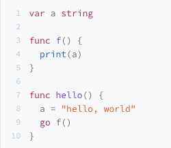
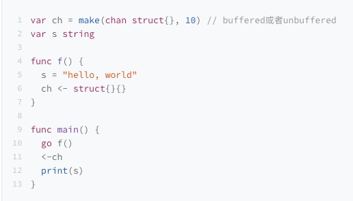
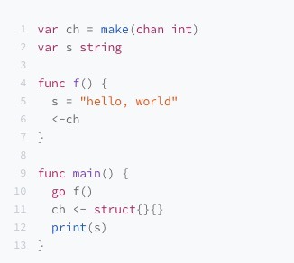
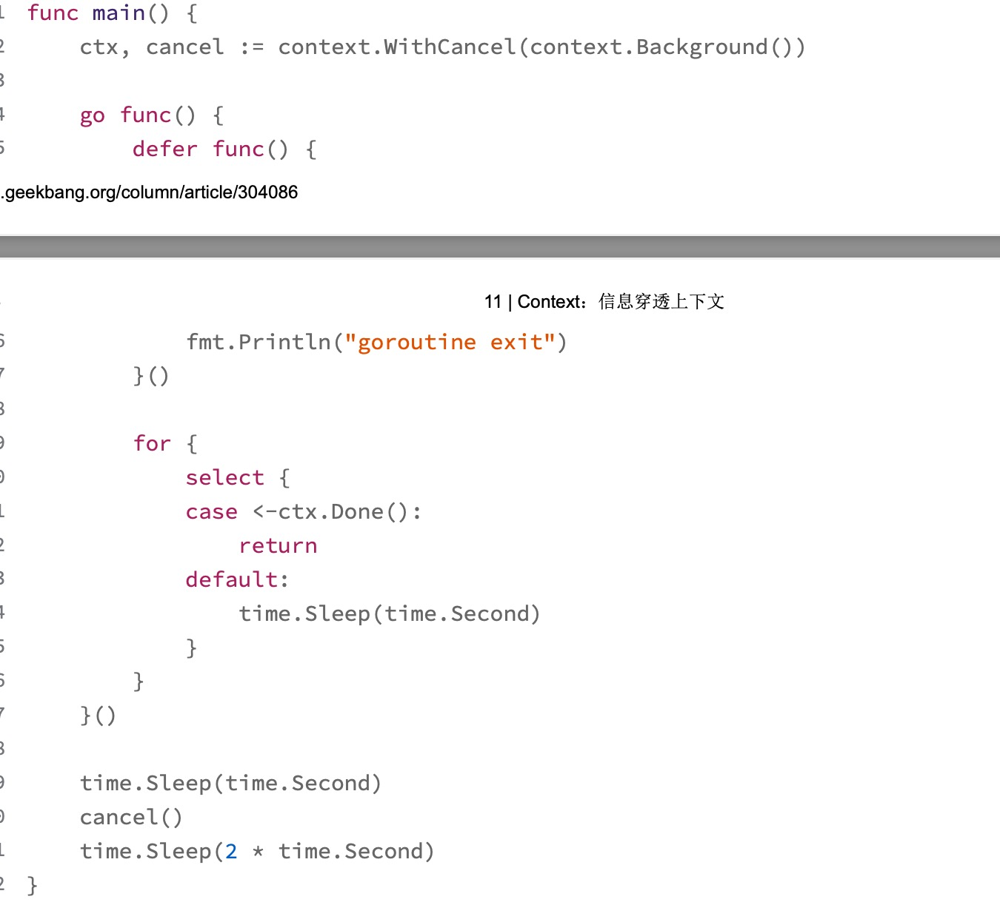

# 一、Go 内存模型
Go内存模型描述的是并发环境中多 goroutine 读相同变量的时候，变量的可见性条件。具体点说，就是指，在什么条件下，
goroutine 在读取一个变量的值的时候，能够看到其它 goroutine 对这个变量进行的写的结果。

由于CPU指令重排和多级Cache的存在，保证多核访问同一个变量变得非常复杂。毕竟，不同CPU架构的处理方式是不一样的，再加上编译器的优化也可能对指令进行重排，
所以编程语言需要一个规范，来明确多线程同时访问同一个变量的可见性和顺序。在编程语言中，这个规范叫做内存模型。

**定义内存模型的目的**：
1. 向广大的程序员提供一种保证，以便他们在做设计和开发程序时，面对同一个数据同时被多个goroutine访问的情况，可以做一些串行化访问的控制。
2. 允许编译器和硬件对程序做一些优化。主要是为编译器开发者提供的保证，这样可以方便他们对Go的编译器做优化

程序在运行的时候，两个操作的顺序可能得不到保证，那该怎么办？

Go内存模型中很重要的概念：happens-before，用来描述两个操作的顺序关系的。如果某些操作能提供happens-before关系，那么，我们就可以100%保证他们之间的顺序。

>**happens-before**

在一个 goroutine 内部，程序的执行顺序和它们的代码指定的顺序是一样的，即使编译器 或者 CPU 重排了读写顺序，从行为上来看，也和代码指定的顺序一样。

对于另一个goroutine来说，就需要happens-before关系来保证了，如果两个action(read或者write）有明确的happens-before关系，就可以确定它们之间的执行顺序（或者行为表现上的顺序）。

通过happens-before定义**两个事件（读、写action）的顺序**：
1. 如果事件1 happens-before事件2，那么我们就可以说事件2在事件1之后发生（happens-after）。
2. 如果事件1不是happens-before事件2， 也不happens-after事件2，那么我们就可以说事件1和事件2是同时发生的。

我们要保证 r 绝对能观察 到 w 操作的结果，那么就需要同时满足两个条件:
1. w happens before r;
2. 其它对 v 的写操作(w2、w3、w4, ...) 要么 happens before w，要么 happens after r，绝对不会和 w、r 同时发生，或者是在它们之间发生。

**单个goroutine的happens-before关系**

在单个goroutine内部，happens-before的关系和代码编写的顺序是一致的。


除了单个 goroutine 内部提供的 happens-before 保证，Go 语言中还提供了一些其它的 happens-before 关系的保证：
1. init 函数
  - 应用程序的初始化是在单一的 goroutine 执行的。如果包 p 导入了包 q，那么，q 的 init 函数的执行一定 happens before p 的任何初始化代码。
  - main 函数一定在导入的包的 init 函数之后执行。
  - 同一个包下可以有多个init函数，但每个文件最多只能有一个init函数，多个init函数按照它们的文件名顺序逐个初始化。

2. goroutine
  - 启动 goroutine 的 go 语句的执行，一定 happens before 此 goroutine 内的代码执行。 在下面的例子中，第8行a的赋值和第9行是在同一个go中，所以第8行肯定happens-before第9行，又由于第9行子goroutine的启动happens-before第4行的输出，那么第8行happens-before第4行。即，一定会打印出"hello world"。

    

  - goroutine 退出的时候，是没有任何 happens- before 保证的

3. Channel
   - 往 Channel 中的发送操作，happens-before 从该 Channel 接收相应数 据的动作完成之前。下面代码中一定会打印"hello world"
   
     
   - close 一个 Channel 的调用，肯定 happens before 从关闭的 Channel 中读取出一个零值。
   - 对于 unbuffered 的 Channel，也就是容量是 0 的 Channel，从此 Channel 中读取数据的调用一定 happens before 往此 Channel 发送数据的调用完成。下面代码中一定会打印"hello world"
   
     
   - 如果 Channel 的容量是 m(m>0)，那么，第 n 个 receive 一定 happens before 第 n+m 个 send 的完成
4. Mutex/RWMutex
   - 第 n 次的 m.Unlock 一定 happens before 第 n+1 m.Lock 方法的返回;
5. Once
   - 对于 once.Do(f) 调用，f 函数的那个单次调用一定 happens before 任何 once.Do(f) 调用的 返回。


我们要保证 r 绝对能观察 到 w 操作的结果，那么就需要同时满足两个条件:
1. w happens before r;
2. 其它对 v 的写操作(w2、w3、w4, ...) 要么 happens before w，要么 happens after r，绝对不会和 w、r 同时发生，或者是在它们之间发生。
除了单个 goroutine 内部提供的 happens-before 保证，Go 语言中还提供了一些其它的 happens-before 关系的保证。


# 二、基础并发原语

## 1）Mutex

Mutex不需要额外的初始化，直接声明变量即可，如果嵌入的 struct 有多个字段，我们一般会把 Mutex 放在要控制的字段上面，然后使用空格把字段分隔开来。

> 同步机制实现基础

1. CAS(Compare And Swap)和原子运算。
2. 信号量sema
   按照runtime/sema.go中的注释：
   Think of them as a way to implement sleep and wakeup

Golang中的sema，提供了休眠和唤醒Goroutine的功能。

1. semacquire函数首先检查信号量是否为0：如果大于0，让信号量减一，返回；
   如果等于0，就调用goparkunlock函数，把当前Goroutine放入该sema的等待队列，并把他设为等待状态。
2. semrelease函数首先让信号量加一，然后检查是否有正在等待的Goroutine： 如果没有，直接返回；如果有，调用goready函数唤醒一个Goroutine。

> Mutex实现

### 1.1 初版Mutex

使用一个 flag 来表示锁是否被持有，实现比较简单：


初版的 Mutex 利用 CAS 原子操作，对 key 这个标志量进行设置。key 不仅仅标识了锁是否被 goroutine 所持有，还记录了当前持有和等待获取锁的
goroutine 的数量。

如果还有等待此锁的其它 goroutine，那么，它会调用 semrelease 方法（第 34 行），利用信号量唤醒等待锁的其它 goroutine 中的一个。

> 不足：性能不是最优的

请求锁的 goroutine 会排队等待获取互斥锁。虽然这貌似很公平，但是从性能上来看，却不是最优的。
因为如果我们能够把锁交给正在占用 CPU 时间片的 goroutine 的话，那就不需要做上下文的切换，在高并发的情况下，可能会有更好的性能。

### 1.2 给新人机会 （第二版Mutex）

Mutex 结构体还是包含两个字段，但是第一个字段已经改成了 state，它的含义也不一样了。

```go
type Mutex struct {
    state int32
    sema  uint32
}


const (
    mutexLocked = 1 << iota // mutex is locked
    mutexWoken
    mutexWaiterShift = iota
)
```
第一位（最小的一位）来表示这个锁是否被持有，第二位代表是否有唤醒的 goroutine，剩余的位数代表的是等待此锁的 goroutine 数


想要获取锁的 goroutine 没有机会获取到锁，就会进行休眠，但是在锁释放唤醒之后，它并不能像先前一样直接获取到锁，还是要和正在请求锁的 goroutine 进行竞争。
这会给后来请求锁的 goroutine 一个机会，也让 CPU 中正在执行的 goroutine 有更多的机会获取到锁，在一定程度上提高了程序的性能。


相对于初版的设计，这次的改动主要就是，新来的 goroutine 也有机会先获取到锁，甚至一个 goroutine 可能连续获取到锁，打破了先来先得的逻辑。但是，代码复杂度也显而易见。

> 不足：性能还有优化空间

虽然这一版的 Mutex 已经给新来请求锁的 goroutine 一些机会，让它参与竞争，没有空闲的锁或者竞争失败才加入到等待队列中。但是其实还可以进一步优化

### 1.3 多给些机会
新来的 goroutine 或者是被唤醒的 goroutine 首次获取不到锁，它们就会通过自旋的方式，尝试检查锁是否被释放。在尝试一定的自旋次数后，再执行原来的逻辑。

>不足：导致饥饿

因为新来的 goroutine 也参与竞争，有可能每次都会被新来的 goroutine 抢到获取锁的机会，在极端情况下，等待中的 goroutine 可能会一直获取不到锁，这就是饥饿问题。

### 1.4 解决饥饿
Go 1.9 中 Mutex 增加了饥饿模式，让锁变得更公平，不公平的等待时间限制在 1 毫秒。 一旦等待者等待的时间超过了这个阈值，Mutex 的处理就有可能进入饥饿模式，优先让等待者先获取到锁


**正常模式**

waiter 都是进入先入先出队列，被唤醒的 waiter 并不会直接持有锁，而是要和新来的 goroutine 进行竞争。新来的 goroutine 有先天的优势，它们正在 CPU 中运行，可能它们的数量还不少，所以，在高并发情况下，被唤醒的 waiter 可能比较悲剧地获取不到锁，这时，它会被插入到队列的前面。如果 waiter 获取不到锁的时间超过阈值 1 毫秒，那么，这个 Mutex 就进入到了饥饿模式。

**饥饿模式**

新来的 goroutine 不会尝试获取锁，即使看起来锁没有被持有，它也不会去抢，也不会 spin，它会乖乖地加入到等待队列的尾部。

如果拥有 Mutex 的 waiter 发现下面两种情况的其中之一，它就会把这个 Mutex 转换成正常模式:
1. 此 waiter 已经是队列中的最后一个 waiter 了，没有其它的等待锁的 goroutine 了；
2.   此 waiter 的等待时间小于 1 毫秒。

正常模式拥有更好的性能, 饥饿模式是对公平性和性能的一种平衡。

**常见的错误场景**:
1. Lock/Unlock 不是成对出现
2. Copy 已使用的 Mutex
3. 重入(Mutex 不是可重入的锁)
4. 死锁


## 2）RWMutex
RWMutex 在某一时刻只能由任意数量的 reader 持有，或者是只被单个的 writer 持有。

如果你遇到可以明确区分 reader 和 writer goroutine 的场景，且有大量的并发读、少量的并发写，并且有强烈的性能需求，你就可以考虑使用读写锁 RWMutex 替换 Mutex。
```go
type RWMutex struct {
	w           Mutex  // held if there are pending writers
	writerSem   uint32 // semaphore for writers to wait for completing readers
	readerSem   uint32 // semaphore for readers to wait for completing writers
	readerCount int32  // number of pending readers
	readerWait  int32  // number of departing readers
}

func (rw *RWMutex) Unlock() {
if race.Enabled {
_ = rw.w.state
race.Release(unsafe.Pointer(&rw.readerSem))
race.Disable()
}

// Announce to readers there is no active writer.
r := atomic.AddInt32(&rw.readerCount, rwmutexMaxReaders)
if r >= rwmutexMaxReaders {
race.Enable()
fatal("sync: Unlock of unlocked RWMutex")
}
// Unblock blocked readers, if any.
for i := 0; i < int(r); i++ {
runtime_Semrelease(&rw.readerSem, false, 0)
}
// Allow other writers to proceed.
rw.w.Unlock()
if race.Enabled {
race.Enable()
}
}
```
采用Write-preferring 方案。一个正在阻塞的 Lock 调用会排除新的 reader 请求到锁。
从上面代码可以看到，唤醒等待读锁的方式，就是通过循环唤醒信号量上等待的goroutines。

## 3) Cond
**基本用法**
1. Signal：唤醒一个等待此Cond的goroutine
2. Broadcast：唤醒所有等待此Cond的goroutine
3. Wait：把caller放入Cond的等待队列中并阻塞，直到被Signal或者Broadcast的方法从队列中唤醒

**常见错误**: 调用wait的时候没有加锁

Cond有3点特性，是Channel无法替代的:
1. Cond与一个Locker关联，可以利用这个Locker对相关的依赖条件更改提供保护
2. Cond可以同时支持Signal和Broadcast，而Channel只能同时支持其中一种
3. Cond的BroadCast方法可以被重复调用

## 4) Once
Once 可以用来执行且仅仅执行一次动作，常常用于单例对象的初始化场景。

实现原理：double-checking
```go
func (o *Once) Do(f func()) {
	// Note: Here is an incorrect implementation of Do:
	//
	//	if atomic.CompareAndSwapUint32(&o.done, 0, 1) {
	//		f()
	//	}
	//
	// Do guarantees that when it returns, f has finished.
	// This implementation would not implement that guarantee:
	// given two simultaneous calls, the winner of the cas would
	// call f, and the second would return immediately, without
	// waiting for the first's call to f to complete.
	// This is why the slow path falls back to a mutex, and why
	// the atomic.StoreUint32 must be delayed until after f returns.

	if atomic.LoadUint32(&o.done) == 0 {
		// Outlined slow-path to allow inlining of the fast-path.
		o.doSlow(f)
	}
}

func (o *Once) doSlow(f func()) {
	o.m.Lock()
	defer o.m.Unlock()
	if o.done == 0 {
		defer atomic.StoreUint32(&o.done, 1)
		f()
	}
}
```

**常见错误**
1. 死锁
   Do 方法会执行一次 f，但是如果 f 中再次调用这个 Once 的 Do 方法的话， 就会导致死锁的情况出现。这还不是无限递归的情况，而是的的确确的 Lock 的递归调用导 致的死锁。
2. **未初始化**
   如果 f 方法执行的时候 panic，或者 f 执行初始化资源的时候失败了，这个时候，Once 还 是会认为初次执行已经成功了，即使再次调用 Do 方法，也不会再次执行 f。

**怎么解决初始化未完成的问题?**

自己实现一个类似 Once 的并发原语，既可以返 回当前调用 Do 方法是否正确完成，还可以在初始化失败后调用 Do 方法再次尝试初始化，直到初始化成功才不再初始化了。

## 5）sync.Map
>Go 内建的 map 类型

使用 struct 类型做 key 其实是有坑的，因为如果 struct 的某 个字段值修改了，查询 map 时无法获取它 add 进去的值。
 
如果要使用 struct 作为 key，我们要保证 struct 对象在逻辑上是不可变 的，这样才会保证 map 的逻辑没有问题。

map 是无序的。 

**常见错误**：
1. 未初始化，和 slice 或者 Mutex、RWmutex 等 struct 类型不同，map 对象必须在使用之前初始化。 如果不初始化就直接赋值的话，会出现 panic 异常
2. 并发读写。并发读写的时候运行时会有检查， 遇到并发问题就会导致 panic。

**如何实现线程安全的map？**
1. 加读写锁：扩展map，支持并发读写
2. 分片加锁：更高效的并发map。 (GetShard是一个关键的方法，能够根据key计算出分片索引)

**sync.Map的使用场景**：
1. 只会增长的缓存系统中，一个 key 只写入一次而被读很多次;
2. 多个 goroutine 为不相交的键集读、写和重写键值对。

很少使用。可以把 sync.Map 看成一个生产环境中很少使用 的同步原语。

**sync.Map的优化点有哪些？**
1. 空间换时间。通过冗余的两个数据结构(只读的 read 字段、可写的 dirty)，来减少加锁对性能的影响。对只读字段(read)的操作不需要加锁
2. 优先从 read 字段读取、更新、删除
3. 动态调整。miss 次数多了之后，将 dirty 数据提升为 read，避免总是从 dirty 中加锁读 取
4. double-checking。加锁之后先还要再检查 read 字段，确定真的不存在才操作 dirty 字 段。
5. 延迟删除。删除一个键值只是打标记，只有在提升 dirty 字段为 read 字段的时候才清理 删除的数据。

## 6）atomic
atomic的提供的方法：
1. Add、CAS (CompareAndSwap)、Swap、Load、Store
2. Value 类型: 可以原子地存取对象类型

第三方库的扩展:
1. atomic 的 API 让熟悉面向对象编程的程序员不爽。 可以用uber-go/atomic
2. 使用 atomic 实现 Lock-Free queue

## 7）WaitGroup
基本用法
```go
func (wg *WaitGroup) Add(delta int)
func (wg *WaitGroup) Done()
func (wg *WaitGroup) Wait()
```
**实现原理**
1. noCopy 的辅助字段，主要就是辅助 vet 工具检查是否通过 copy 赋值这个 WaitGroup 实例。 
    vet 工具的 copylocks 检测器有这么一个功能：检测带锁类型（如 sync.Mutex） 的错误复制使用，这种不当的复制，会引发死锁。
   ```go
   type WaitGroup struct {
       noCopy noCopy
   
       // 64-bit value: high 32 bits are counter, low 32 bits are waiter count.
       // 64-bit atomic operations require 64-bit alignment, but 32-bit
       // compilers only guarantee that 64-bit fields are 32-bit aligned.
       // For this reason on 32 bit architectures we need to check in state()
       // if state1 is aligned or not, and dynamically "swap" the field order if
       // needed.
       state1 uint64
       state2 uint32
   }
   
   type noCopy struct{}
   
   // Lock is a no-op used by -copylocks checker from `go vet`.
   func (*noCopy) Lock()   {}
   func (*noCopy) Unlock() {}
   ```
2. state1，一个具有复合意义的字段，包含 WaitGroup 的计数、阻塞在检查点的 waiter 数和信号量。

**常见错误**：
1. 计数器为负值，panic
2. 前一个 Wait 还没结束就重用 WaitGroup， panic

## 8）Channel
Channel分为只能接收、只能发送、既可以接收又可以发送三种类型, 按是否有缓存可分为buffered chan和unbuffered chan。
nil 是 chan 的零值，是一种特殊的 chan，对值是 nil 的 chan 的发送接收调用者总是会阻塞。

close 会把 chan 关闭掉，cap 返回 chan 的容量，len 返回 chan 中缓存的还未被取走的元素数量。

**应用场景**
1.  数据交流：当作并发的 buffer 或者 queue，解决生产者 - 消费者问题。多个 goroutine 可以并发当作生产者(Producer)和消费者(Consumer)。
2. 数据传递:一个 goroutine 将数据交给另一个 goroutine，相当于把数据的拥有权 (引 用) 托付出去。
3. 信号通知:一个 goroutine 可以将信号 (closing、closed、data ready 等) 传递给另一 个或者另一组 goroutine
4. 任务编排:让一组 goroutine 按照一定的顺序并发或者串行的执行，这就是编排的 功能。
5. 锁：利用 Channel 也可以实现互斥锁的机制。

**常见错误**：
1.  panic
   - close 为 nil 的 chan
   - send 已经 close 的 chan
   - close 已经 close 的 chan
2. goroutine 泄漏
   超时导致未读，结果就是子 goroutine 就阻塞在第 7 行永远结束不了，进而导致 goroutine 泄漏。unbuffered chan goroutine 泄漏的问题.
   ```go
       ch := make(chan bool)
       go func() {
           //模拟业务耗时
           time.Sleep(timeout + time.Second)
           ch <- true
           fmt.Println("exit go")
       }()
       select {
       case result := <-ch:
           return result
       case <-time.After(timeout):
           return false
       }
   ```
   解决这个 Bug 的办法很简单，就是将 unbuffered chan 改成容量为 1 的 chan，这样第 7 行就不会被阻塞了。

**Channel最佳实践**:
Channel 并不是处理 并发问题的“银弹”，有时候使用并发原语更简单，而且不容易出错。
1. 共享资源的并发访问使用传统并发原语;
2. 复杂的任务编排和消息传递使用 Channel;
3. 消息通知机制使用 Channel，除非只想 signal 一个 goroutine，才使用 Cond;
4. 简单等待所有任务的完成用 WaitGroup，也有 Channel 的推崇者用 Channel，都可 以;
5. 需要和 Select 语句结合，使用 Channel;
6. 需要和超时配合时，使用 Channel 和 Context。

## 9）Context
上下文(Context)是指，在 API 之间或者方法调用之间，所传递的除了业务参数之外的额外信息。

**接口定义**
```go
type Context interface {
    Deadline() (deadline time.Time, ok bool)
    Done() <-chan struct{}
    Err() error
    Value(key interface{}) interface{} 
}
```
- Deadline 方法会返回这个 Context 被取消的截止日期。如果没有设置截止日期，ok 的值 是 false。后续每次调用这个对象的 Deadline 方法时，都会返回和第一次调用相同的结 果。
- Done 方法返回一个 Channel 对象。在 Context 被取消时，此 Channel 会被 close。
- 如果 Done 没有被 close，Err 方法返回 nil;如果 Done 被 close，Err 方法会返回 Done 被 close 的原因。
- Value 返回此 ctx 中和指定的 key 相关联的 value。

**基本使用方法**
1. 创建常用的顶层 Context
   - context.Background():返回一个非 nil 的、空的 Context，没有任何值，不会被 cancel，不会超时，没有截止日期。一般用在主函数、初始化、测试以及创建根 Context 的时候。
   - context.TODO():返回一个非 nil 的、空的 Context，没有任何值，不会被 cancel，不会超时，没有截止日期。当你不清楚是否该用Context，或者目前还不知道要传递一些什么上下文信息的时候，就可以使用这个方法
   - 可以直接使用context.Background,事实上，它们两个底层的实现 是一模一样的
2. 创建特殊用途 Context 
   - context.WithValue(parent Context, key, val any) Context: 基于 parent Context 生成一个新的 Context，保存了一个 key-value 键值对，常常用来传递上下文。其实创建了一个类型为 valueCtx 的 Context，它持有一个 key-value 键值对，还持有 parent 的 Context，覆盖了 Value 方法，优先 从自己的存储中检查这个 key，不存在的话会从 parent 中继续检查。
   - context.WithCancel(parent Context) (ctx Context, cancel CancelFunc): 在一些需要主动取消长时间的任务时，创建这种类型的 Context，然后把这个 Context 传给长时间执行任务的 goroutine。当这个 cancelCtx 的 cancel 函数被调用的时候，或者 parent 的 Done 被 close 的时候， 这个 cancelCtx 的 Done 才会被 close。cancel 是向下传递的，如果一个 WithCancel 生成的 Context 被 cancel 时，如果它的子 Context(也有可能是孙，或者更低，依赖子的类型)也是 cancelCtx 类型的，就会被 cancel，但是不会向上传递。parent Context 不会因为子 Context 被 cancel 而 cancel。
   - context.WithDeadline(parent Context, d time.Time) (Context, CancelFunc):会返回一个 parent 的副本，并且设置了一个不晚于参数 d 的截止时间，类 型为 timerCtx(或者是 cancelCtx)。如果它的截止时间晚于 parent 的截止时间，那么就以 parent 的截止时间为准，并返回一 个类型为 cancelCtx 的 Context，因为 parent 的截止时间到了，就会取消这个 cancelCtx。
     - timerCtx 的 Done 被 Close 掉，主要是由下面的某个事件触发的:截止时间到了;cancel 函数被调用;parent 的 Done 被 close。
   - context.WithTimeout(parent Context, timeout time.Duration) (Context, CancelFunc):WithTimeout 其实是和 WithDeadline 一样，只不过一个参数是超时时间，一个参数是截 止时间。超时时间加上当前时间，其实就是截止时间

**使用场景**
1. 经常使用 Context 来取消一个 goroutine 的运行，这是 Context 最常用的场景之 一，Context 也被称为 goroutine 生命周期范围(goroutine-scoped)的 Context，把 Context 传递给 goroutine。但是goroutine 需要尝试检查 Context 的 Done 是否关闭 了:
   
2.  Context 实现一个带超时功能的调用，比如访问远程的一个微服务
3. 在 Context 被 cancel 的 时候，你能关闭和服务器的连接，中断和数据库服务器的通讯、停止对本地文件的读写， 那么，这样的超时处理，同时能减少对服务调用的压力，但是这依赖于你对超时的底层处理机制。

## 10）Pool
Go 的自动垃圾回收机制还是有一个 STW(stop-the-world，程序暂 停)的时间。所以，一般我们做性能优化的时候，会采用对象池的方式，把不用的对象回收起来，避免
被垃圾回收掉，这样使用的时候就不必在堆上重新创建了。

> sync.Pool

用来保存一组可独立访问的临时对象。但该pool有不太方便的地方：它池化的对象会在未来的某 个时候被毫无预兆地移除掉。而且，如果没有别的对象引用这个被移除的对象的话，这个 被移除的对象就会被垃圾回收掉，这对于数据库长连接等场景是不合适的。

**sync.Pool 的坑**
1. 内存泄漏。sync.Pool做buffer池，可能会有内存泄漏的风险：取出来的bytes.Buffer在使用的时候，我们可以往这个元素中增加大量的byte数据, 这会导致底层的byte slice的容量可能会变得很大。这个时候，即使Reset再放回池子中，这些bytes slice的容量不会改变，所占的空间依然很大。 eg：package fmt中有这个问题，解决办法是对于超过一定大小的buffer，就直接丢弃

**buffer池**
1. bytebufferpool:fasthttp作者valyala提供的一个buffer池，基本功能和sync.Pool相同，它的底层也是使用sync.Pool实现的，包括会检测最大的buffer，超过最大尺寸的buffer，就会被丢弃

**Worker Pool**

goroutine 是一个很轻量级的“纤程”，在一个服务器上可以创建十几万甚 至几十万的 goroutine。但是“可以”和“合适”之间还是有区别的: 一个 goroutine 初始的栈大小是 2048 个字节，并且在需要的时候可以扩展到 1GB，所以，大量的 goroutine 还是很耗资源的。同时，大量的 goroutine 对于调度和垃圾回收的耗时还是会有影响的。

推荐三款易用的 Worker Pool： gammazero/workerpool、  ivpusic/grpool、dpaks/goworkers

**server端**

在标准库 net/rpc 包中，Server 端需要解析大量客户端的请求(Request)，这些短暂使用的Request 是可以重用的。


# 三、扩展并发原语
## 1）Semaphore
前面在分析Mutex实现时总会看到这几个函数：
```go
func runtime_Semacquire(s *uint32)
func runtime_SemacquireMutex(s *uint32, lifo bool, skipframes int)
func runtime_Semrelease(s *uint32, handoff bool, skipframes int)
```
这几个函数就是信号量的PV操作，不过他们都是给Go内部使用的，如果想使用信号量，那就可以使用官方的扩展包：Semaphore.Weighted，这是一个带权重的信号量。
```go
type Weighted struct {
	size    int64 // 设置一个最大权值
	cur     int64 // 标识当前已被使用的资源数
	mu      sync.Mutex // 提供临界区保护
	waiters list.List // 阻塞等待的调用者列表
}
type weighted interface {
    Acquire(context.Context, int64) error
    TryAcquire(int64) bool
    Release(int64)
}
```


**实现原理**
1. Mutex 提供并发时的读写保护
2. 利用select channel的方式实现堵塞/唤醒
```go
func (s *Weighted) Acquire(ctx context.Context, n int64) error {
	s.mu.Lock() // 加锁保护临界区
	// 有资源可用并且没有等待获取权值的goroutine
	if s.size-s.cur >= n && s.waiters.Len() == 0 {
		s.cur += n // 加权
		s.mu.Unlock() // 释放锁
		return nil
	}
	// 要获取的权值n大于最大的权值了
	if n > s.size {
		// 先释放锁，确保其他goroutine调用Acquire的地方不被阻塞
		s.mu.Unlock()
		// 阻塞等待context的返回
		<-ctx.Done()
		return ctx.Err()
	}
	// 走到这里就说明现在没有资源可用了
	// 创建一个channel用来做通知唤醒
	ready := make(chan struct{})
	// 创建waiter对象
	w := waiter{n: n, ready: ready}
	// waiter按顺序入队
	elem := s.waiters.PushBack(w)
	// 释放锁，等待唤醒，别阻塞其他goroutine
	s.mu.Unlock()

	// 阻塞等待唤醒
	select {
	// context关闭
	case <-ctx.Done():
		err := ctx.Err() // 先获取context的错误信息
		s.mu.Lock()
		select {
		case <-ready:
			// 在context被关闭后被唤醒了，那么试图修复队列，假装我们没有取消
			err = nil
		default:
			// 判断是否是第一个元素
			isFront := s.waiters.Front() == elem
			// 移除第一个元素
			s.waiters.Remove(elem)
			// 如果是第一个元素且有资源可用通知其他waiter
			if isFront && s.size > s.cur {
				s.notifyWaiters()
			}
		}
		s.mu.Unlock()
		return err
	// 被唤醒了
	case <-ready:
		return nil
	}
}
```

## SingleFlight
请求合并SingleFlight。SingleFlight 是 Go 开发组提供的一个扩展并发原语。它的作用是，在处理多个 goroutine 同时调用同一个函数的时候，
只让一个 goroutine 去调用这个函数，等到这个 goroutine 返回结果的时候，再把结果返回给这几个同时调用的goroutine，这样可以减少并发调用的数量。

**使用场景**
1. sync.Once 主要是用在单次初始化场景 中，而 SingleFlight 主要用在合并并发请求的场景中，尤其是缓存场景, eg: 解决缓存击穿
2. 在面对秒杀等大并发请求的场景，而且这些请求都是读请求 时，你就可以把这些请求合并为一个请求，这样，你就可以将后端服务的压力从 n 降到 1。尤其是在面对后端是数据库这样的服务的时候
3. 使用的前提是不用考虑幂等性问题。

**实现原理**: SingleFlight 的数据结构是 Group，SingleFlight 使用互斥锁 Mutex 和 Map 来实现。Mutex 提供并发时的读写保护，
Map 用来保存同一个 key 的正在处理(in flight)的请求。


## ErrGroup 分组操作
我们经常会碰到需要将一个通用的父任务拆成几个小任务并发执行的场景，其实，将一个大的任务拆成几个小任务并发执行，可以有效地提高程序的并发度。
ErrGroup 就是用来应对这种场景的。它和 WaitGroup 有些类似，Group 也有 Wait 方法，等所有的子任务都完成后，它才会返回，否则 只会阻塞等待。如果有多个子任务返回错误，它只会返回第一个出现的错误，如果所有的 子任务都执行成功，就返回 nil。

**基本用法**
```go
func WithContext(ctx context.Context) (*Group, context.Context){...}
func (g *Group) Go(f func() error) {...}
func (g *Group) Wait() error {...}
```

**扩展库**
1. bilibili/errgroup: 可以使用一个固定数量的 goroutine 处理子任务; cancel，失败的子任务可以 cancel 所有正在执行任务; recover，而且会把 panic 的堆栈信息放到 error 中，避免子任务 panic 导致的程序崩 溃。
2. neilotoole/errgroup: 直接替换官方的 ErrGroup，方法都一样，原有功能也一样，只不过增加了可以控制并发 goroutine 的功 能。


# Q&A
**如何实现可重入锁?**
1. 方案一：通过 hacker 的方式获取到 goroutine id，记录下获取锁的 goroutine id，它可以实现 Locker 接口。
2. 方案二：调用 Lock/Unlock 方法时，由 goroutine 提供一个 token，用来标识它自己，而不是我们通过 hacker 的方式获取到 goroutine id，但是，这样一来，就不满足 Locker 接口了。

尽管拥有者可以多次调用 Lock，但是也必须调用相同次数的 Unlock，这样才能把锁释放掉。这是一个合理的设计，可以保证 Lock 和 Unlock 一一对应。


**如何获取锁等待者的数量等指标？**

锁是性能下降的“罪魁祸首”之一，所以，有效地降低锁的竞争，就能够很好地提高性能。因此，监控关键互斥锁上等待的 goroutine 的数量，是我们分析锁竞争的激烈程度的一个重要指标。

Mutex 结构中的 state 字段有很多个含义，通过 state 字段，你可以知道锁是否已经被某个 goroutine 持有、当前是否处于饥饿状态、是否有等待的 goroutine 被唤醒、等待者的数量等信息。但是，state 这个字段并没有暴露出来。
可以通过 unsafe 的方式获取mutex地址，从而获取state的字段值。


